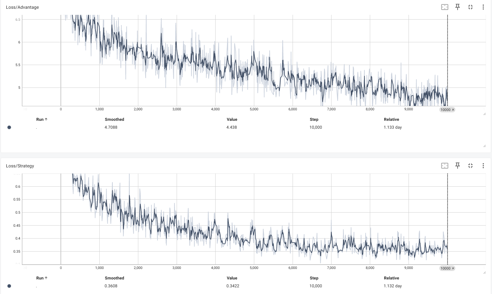
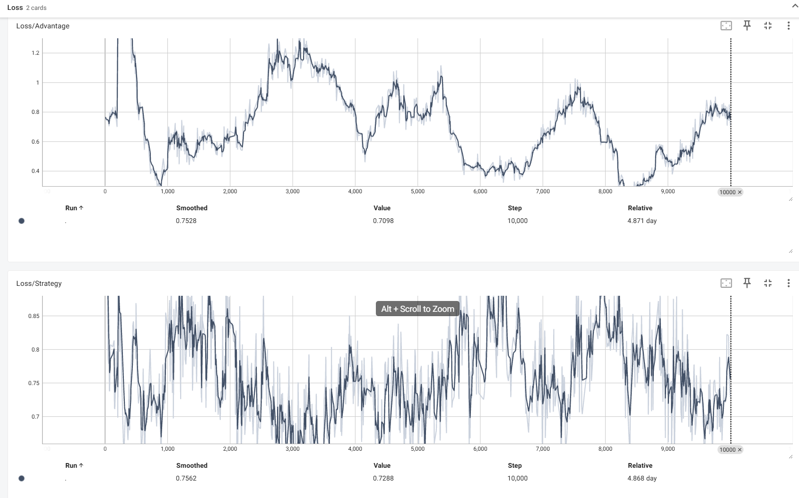
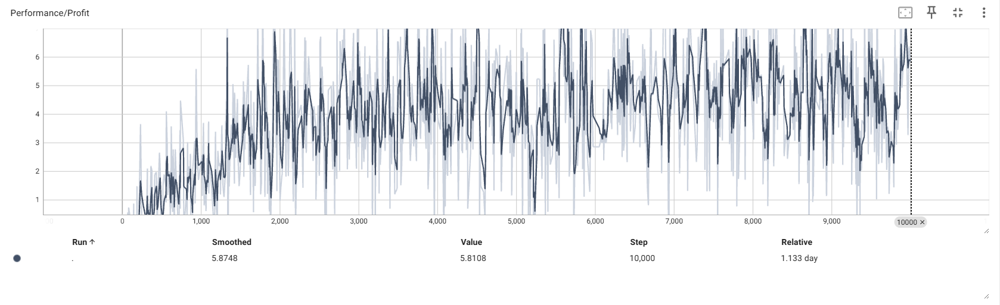
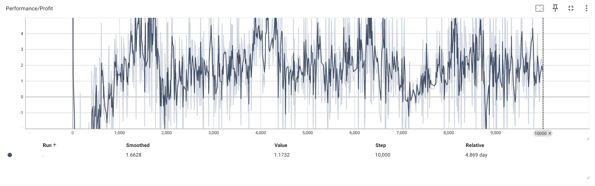
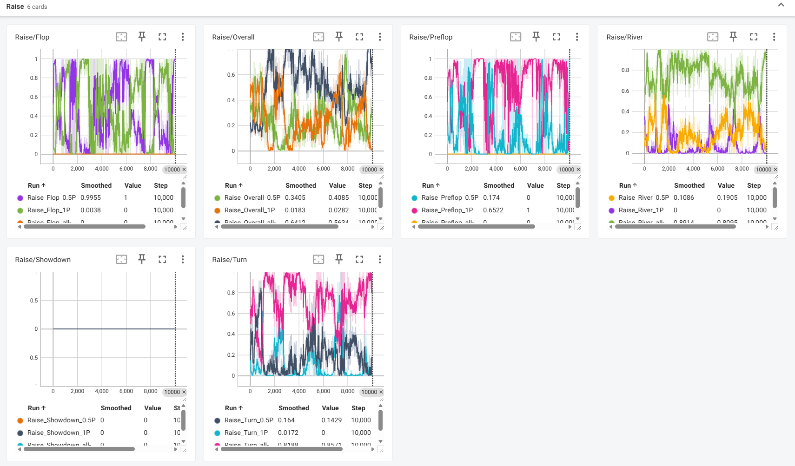
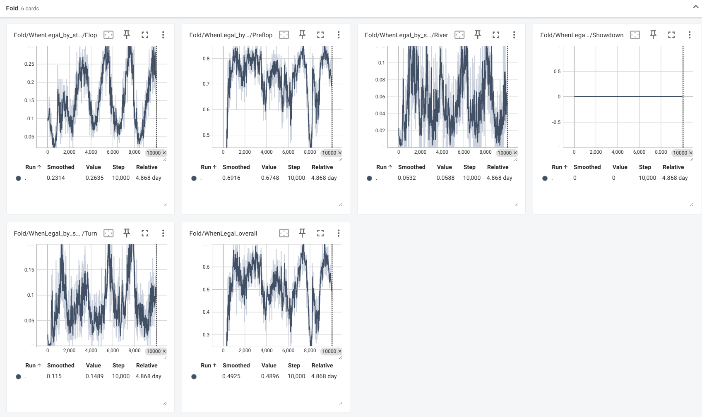
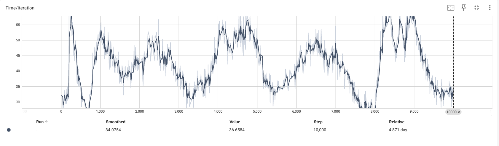
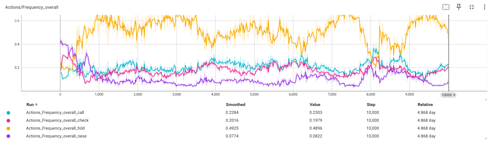
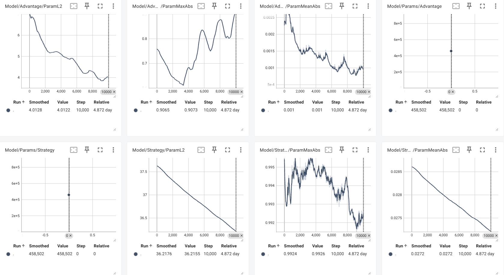
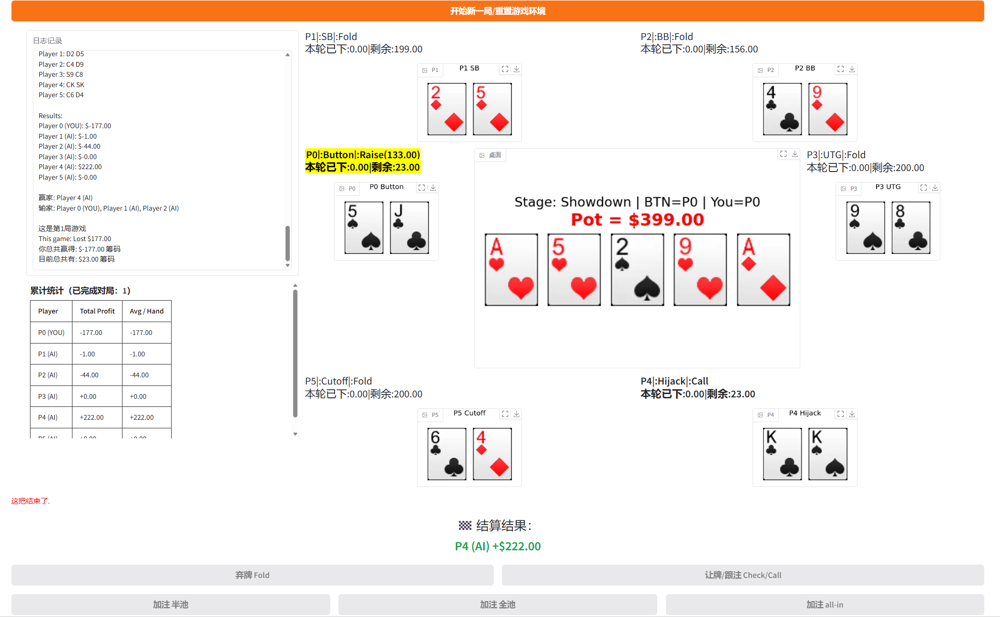

# no_limit_6_players_texas_holdem_deepcfr_AI_agent
a six-player Texas Hold'em poker agent based on DeepCFR
# 德州扑克AI
- 这是一个基于deepcfr框架魔改的六人桌德州扑克agent
- 一切都是为了落地!请记住本项目的宗旨!一切都是为了方便落地!
# 项目介绍以及主要改进点
- 六人桌无限注，起始筹码是200，小盲1，大盲2。暂时不支持改，除非重新训练。
- 合法动作:fold/ check/call/ raise `0.5pot` / raise `1.0pot` /raise `all-in`. 下注挡位为什么不做成连续的呢?连续值比较难学，因为是一个回归问题，分类比较简单学。而且从实际落地来讲，这三挡位完全够用了。
- 训练细节:使用的仍然是deepcfr这套框架，整体分为两个阶段，第一个阶段是从scratch出发，和一个我自己写的逻辑机器人进行对战，这个逻辑机器人还是很复杂的。第一阶段的目标是为了建立对手牌强度的大致认知，也就是知道什么是大牌，什么是小牌。第二阶段训练就是自博弈阶段了，也就是强化学习。第二阶段不断地和不同iteration阶段保存的agent进行对战，始终读取最新的五个agent进行对战。
- 魔改点1：更强的random_agent。经过实验得出结论：第一阶段和random_agent对战是很有必要的，如果你直接从0开始进行自博弈，不好学到东西。这个random_agent不能是纯随机的random，我的逻辑是例如AK这样的牌，preflop阶段会有0.6的概率下halfpot，0.4的概率下fullpot这种，这个random_agent要有足够的强度。
- 魔改点2：cfr-traverse的剪枝工作。cfr-traverse是一个足够复杂的过程，因为要对整个游戏树进行展开，但是有些地方是没必要进行展开的。例如：当我的手牌是23s或者24o这样，那么我会直接弃掉不玩对吧？agent也是这样做的。再者，如果我有一个free-check的机会，那么需要执行fold吗？如果是preflop，此时主动all-in合理吗？再或者我已经all-in了，那么fold合理吗？甚至BB位置，可以free-check，就不要fold，我们可以多看一手牌对吧？ 一切都是为了符合正常人的思路，有时候agent确实不好学，那么就直接限制死也行。
- 魔改点3：关于下注。下注应该是最难学的，同样，我们也从人的角度出发，去给agent做一些限制。关于min_raise这个东西，min_raise按理来说是合法的即前前下注额度减去前下注额度的绝对值对吧？但是在实际cfr-traverse过程中，这个下注挡位严重拖慢了cfr-traverse的训练效率，因此我直接删除了这个挡位。此外，每条street的下注次数上限也值得思考，注意是次数，而不是额度。如果在有限的次数内，下注科学合理的额度，那么我认为也是值得的。还是那句话，为了拟人化，为了落地。
- 魔改点4：关于后悔值的修正。后悔值是我们训练的样本，也就是说后悔值是否科学，从根本上影响着我们agent的表现。首先我有一些结论：不要做归一化，归一化会让你的loss变很低倒是不假，但是抹平了模型对输多少，赢多少的差异化感知，因为德州涉及到输赢多少的问题，而不是简简单单的赢和输。此外，后悔值剪裁是非常有必要的，不然你会梯度爆炸。第二阶段由于引入了对手模型的缘故，对手走到此节点的概率我们是知道的，因此某个节点的后悔值应该乘以对手到达的概率，相当于一个修正项。
- 魔改点5：关于特征以及特征融合。网络我仍然使用了非常经典的resnet架构，对于强化学习而言这已经足够了，transformer倒是也试过，但是个人觉得没什么大的用处。你知道你的模型为什么分辨不出来顺子，同花，葫芦，再或者两头卡顺，单调顺，卡同花等等牌型吗？有可能是你迭代不够，不过更大的可能是你的特征不够明确。请参照`src/core/model_clean_model_input.py`，直接告诉模型，不要只放手牌和公共牌进去，不然这种隐式的特征太难学了，你不如直接告诉模型，你当前是什么牌。其次，关于raise_logits,最终的raise_logits = 选择raise的logits + 所有挡位的logits，参考 `src/core/deep_cfr_clean_model_input.py` 468行。双头双输出，要比单头单输出更好一些。
- 魔改点6：关于loss。优势网络因为需要预测后悔值的缘故，经常使用mse_loss作为损失函数。但是实际上而言有点粗糙，方差有点太大。这里为了稳妥起见，我用了huber_loss。同时第二阶段不要使用学习率衰减。
- 魔改点7：就是一些小trick，例如经验回放的权重设计、防止logits=0时候被分走概率、huber_delta调参等等...
# 项目体验以及部署
首先 `pip install -r requirements.txt`，重要的事情说三遍必须是python3.11.
cd进根目录
安装pokers环境：
`pip install pokers-0.1.2-cp311-cp311-manylinux_2_28_x86_64.whl`
pokers是rust编写的德州第三方库，但是有一些bug。我修复过后重新进行了编译，所以直接安装我给你的就行了。
gradio部署：
请执行： `python -m scripts.gradio --port ****`  默认是8800
然后在你本地浏览器打开就可以体验了。
训练指标查看：
请执行：`tensorboard --logdir logs/self_v2 --bind_all --port 0`
# 指标记录：
第一阶段的损失，看上去在慢慢收敛。

第二阶段的损失，看上去在震荡，不过也正常，二阶段是纯强化学习。

第一阶段的对局平均获利即每一手赢多少钱，随着训练的进行，最终也是水上。

第二阶段的对局平均获利。

不同street raise的频率以及各个挡位选择的频率

不同street fold的频率

不同iteration的traverse时间

不同动作的选择频率

一些模型参数的监控情况

# 部署界面：
自己做了一个ui界面：

